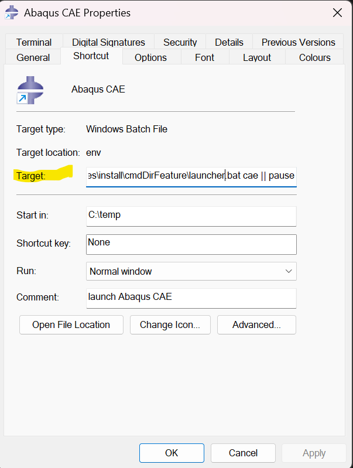

# ✅ Guideline to Link Abaqus with Fortran (Intel oneAPI 2025)

Running Abaqus subroutines is not straightforward, but once configured correctly, you can fully exploit the advanced modeling capabilities Abaqus offers.

This brief tutorial will help you link Abaqus with Fortran using the **latest Intel oneAPI 2025** toolkits. This process is not well documented online, so this guide should save you hours of trial and error.

---

## 🧰 What You’ll Need

1. **Intel® oneAPI Base Toolkit**  
   👉 [Download here](https://www.intel.com/content/www/us/en/developer/tools/oneapi/base-toolkit-download.html) (Version: `2025.2.0`)

2. **Intel® oneAPI HPC Toolkit**  
   👉 [Download here](https://www.intel.com/content/www/us/en/developer/tools/oneapi/hpc-toolkit.html)

3. **Visual Studio 2022 Community Edition**  
   👉 [Download here](https://visualstudio.microsoft.com/downloads/)

4. **Abaqus 2025** (or the version you are using)

---

## ⚙️ Step-by-Step Setup

### 1. Install Visual Studio 2022
- During installation, **enable** the workload:
  > ✅ **Desktop Development with C++**

---

### 2. Install Intel® oneAPI Base Toolkit
- In Step 3 of the installer, it should **auto-detect Visual Studio 2022**.
- Make sure it's selected before completing the installation.

---

### 3. Install Intel® oneAPI HPC Toolkit
- This includes the **Fortran compiler** (`ifx`).
- Follow similar steps as the Base Toolkit installer.

---

### 4. Install Abaqus

---

### 5. Add Required Paths to Environment Variables
Add the following directories to your **System Environment Variables**:

- `C:\Program Files (x86)\Intel\oneAPI\compiler\2025.2\env`
- `C:\Program Files\Microsoft Visual Studio\2022\Community\VC\Auxiliary\Build`

---

### 6. Modify `abq2025.bat`
Go to `C:\SIMULIA\Commands`


Edit the file `abq2025.bat` and insert the following lines **after `setlocal`**:

```
call "C:\Program Files (x86)\Intel\oneAPI\compiler\2025.2\env\vars.bat" intel64 vs2022
call "C:\Program Files\Microsoft Visual Studio\2022\Community\VC\Auxiliary\Build\vcvars64.bat"
```
The final file should look like this:

```
@echo off
setlocal
call "C:\Program Files (x86)\Intel\oneAPI\compiler\2025.2\env\vars.bat" intel64 vs2022
call "C:\Program Files\Microsoft Visual Studio\2022\Community\VC\Auxiliary\Build\vcvars64.bat"
set ABA_DRIVERNAME=%~nx0
"C:\SIMULIA\EstProducts\2025\win_b64\code\bin\SMALauncher.exe" %*
endlocal
```


### 7. Modify Abaqus Shortcuts

#### a. Abaqus CAE Shortcut

1. Locate the Abaqus CAE shortcut on your desktop or start menu.
2. Right-click on it → **Properties**
3. In the **Target** field, prepend the following line:

`"C:\Program Files (x86)\Intel\oneAPI\compiler\2025.2\env\vars.bat" intel64 vs2022 &`

4. Click **Apply** and then **OK**

> 🖼️ Example:
> 

---

#### b. Abaqus Command Shortcut

1. Repeat the same steps as above, but for the **Abaqus Command** shortcut.
2. Again, prepend the same command to the **Target** field:

`"C:\Program Files (x86)\Intel\oneAPI\compiler\2025.2\env\vars.bat" intel64 vs2022 &`


---

### 8. Run `ifort2ifx.pyc`

Open the command prompt and execute:

```
abq2025 python ifort2ifx.pyc
```
### 9. ✅ Verify the Setup

Open a terminal or command prompt and run the following command:

```
abaqus verify -user_std
```
You should see an output like this:

```
Verify test : Abaqus/Standard with user subroutines verification

result : PASS
```

If you see `PASS`, your configuration is working correctly!


### 10. 🛠️ (Optional) Modify win86_64.env if You Encounter Issues
If the verification fails or user subroutines aren't compiling properly, try modifying the environment file:

1. Navigate to the following directory:

`C:\SIMULIA\EstProducts\2025\win_b64\SMA\site`
Open the file named:
`win86_64.env`

Replace the existing compile_fortran and link_sl entries with the following:

```
compile_fortran = ['ifx',
    '/c', '/fpp', '/extend-source',
    '/DABQ_WIN86_64', '/DABQ_FORTRAN',
    '/names:lowercase',
    '/recursive',
    '/reentrancy:threaded',
    '/fp:precise',
    '/Qprec-div',
    '/Qpc64',
    '/protect-parens',
    '/align:array64byte',
    '/include:%I', '/include:' + abaHomeInc, '%P']

link_sl = 'LINK /NODEFAULTLIB:LIBCMT.LIB /dll /def:%E /out:%U %F %A %L %B'

```
Save the file and re-run your user subroutine job.